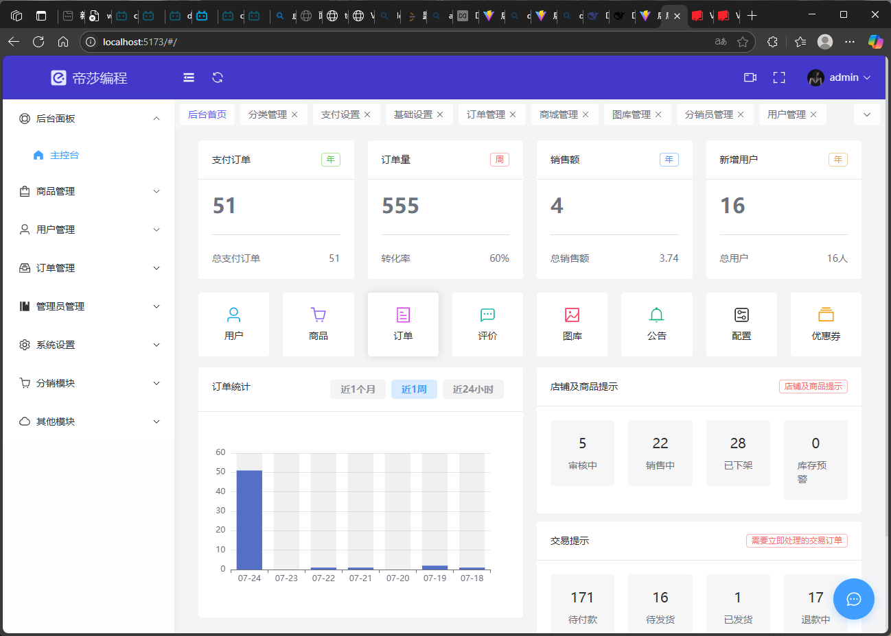
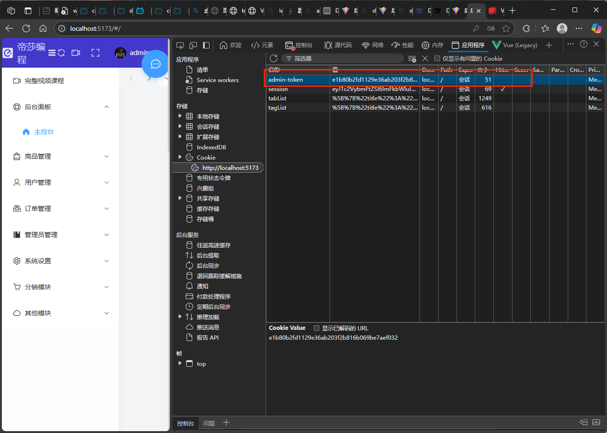
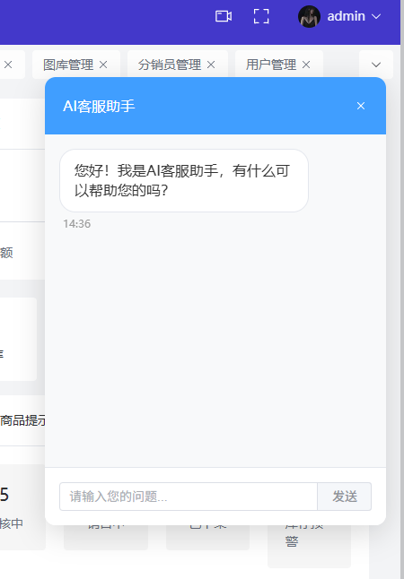

# RAG_shop 带有人工智能助手的商城系统

一个基于 Vue 3 + Vite + Element Plus 构建的现代化电商后台管理系统，提供完整的商城管理功能。带有RAG功能的绿洲商城（可支持仅LLM和LLM+RAG两种形式）。

## 🚀 技术栈

- **前端框架**: Vue 3 (Composition API)
- **构建工具**: Vite
- **UI 组件库**: Element Plus
- **状态管理**: Vuex
- **路由管理**: Vue Router
- **HTTP 客户端**: Axios
- **图表库**: ECharts
- **富文本编辑器**: TinyMCE
- **CSS 框架**: WindiCSS
- **动画库**: GSAP
- **工具库**: VueUse

## 📋 功能模块

### 🏠 首页仪表板
- 数据统计概览
- 图表数据展示
- 快捷操作入口

### 🛍️ 商品管理
- **商品列表**: 商品的增删改查、批量操作
- **分类管理**: 商品分类的层级管理
- **规格管理**: 商品规格属性配置
- **评论管理**: 用户评论的审核与管理

### 👥 用户管理
- **用户列表**: 用户信息管理、状态控制
- **会员等级**: 会员等级设置与权益配置

### 🎫 营销管理
- **优惠券管理**: 优惠券的创建、发放与使用统计
- **分销管理**: 分销员管理与分销设置

### 📦 订单管理
- 订单列表查看
- 订单状态管理
- 订单详情查看
- 发货管理

### ⚙️ 系统设置
- **基础设置**: 网站基本信息配置
- **支付设置**: 支付方式配置
- **物流设置**: 快递公司与运费配置

### 📢 内容管理
- **公告管理**: 系统公告的发布与管理
- **图库管理**: 图片资源的上传与分类管理

### 🔐 权限管理
- **管理员管理**: 后台管理员账号管理
- **角色管理**: 角色权限分配
- **权限管理**: 细粒度权限控制

### 🤖 AI 客服
- **智能客服**: 集成 Kimi AI 的智能客服系统
- **AnythingLLM**: 支持本地部署的 RAG 智能客服
- **实时对话**: 流式输出，打字机效果
- **拖拽窗口**: 可拖拽的悬浮客服窗口

## 📸 系统截图

### 登录页面


### 主控台


### Token持久化


### AnythingLLM客服


## 🛠️ 安装与运行

### 环境要求
- Node.js >= 16.0.0
- npm >= 8.0.0

### 安装依赖
```bash
npm install
```

### 开发环境运行
```bash
npm run dev
```

### 生产环境构建
```bash
npm run build
```

### 预览构建结果
```bash
npm run preview
```

## 📁 项目结构

```
shop-admin/
├── public/                 # 静态资源
│   ├── tinymce/           # TinyMCE 编辑器资源
│   ├── alipay.png         # 支付宝图标
│   └── wepay.png          # 微信支付图标
├── src/
│   ├── api/               # API 接口
│   ├── assets/            # 项目资源
│   ├── components/        # 公共组件
│   │   ├── CustomerService.vue    # Kimi AI 客服
│   │   ├── anythingllm.vue        # AnythingLLM 客服
│   │   ├── FormDrawer.vue         # 表单抽屉
│   │   ├── ChooseImage.vue        # 图片选择器
│   │   └── ...
│   ├── composables/       # 组合式函数
│   ├── layouts/           # 布局组件
│   ├── pages/             # 页面组件
│   │   ├── goods/         # 商品管理
│   │   ├── user/          # 用户管理
│   │   ├── order/         # 订单管理
│   │   ├── setting/       # 系统设置
│   │   └── ...
│   ├── router/            # 路由配置
│   ├── store/             # 状态管理
│   └── main.js            # 入口文件
├── img/                   # 项目截图
└── package.json
```

## 🔧 核心特性

### 响应式设计
- 适配桌面端和移动端
- 灵活的布局系统

### 权限控制
- 基于角色的权限管理
- 路由级别的权限控制
- 按钮级别的权限控制

### 数据可视化
- ECharts 图表集成
- 实时数据更新
- 多种图表类型支持

### 文件管理
- 图片上传与预览
- 文件分类管理
- 批量操作支持

### AI 智能客服
- 支持 Kimi AI 和 AnythingLLM
- 流式输出和打字机效果
- 可拖拽的悬浮窗口
- RAG 知识库问答

## 📄 许可证

本项目采用 MIT 许可证 - 查看 [LICENSE](LICENSE) 文件了解详情

## 📞 联系方式

如有问题或建议，请通过以下方式联系：

- 提交 Issue
- 发送邮件
- 项目讨论区

---

⭐ 如果这个项目对你有帮助，请给它一个星标！
